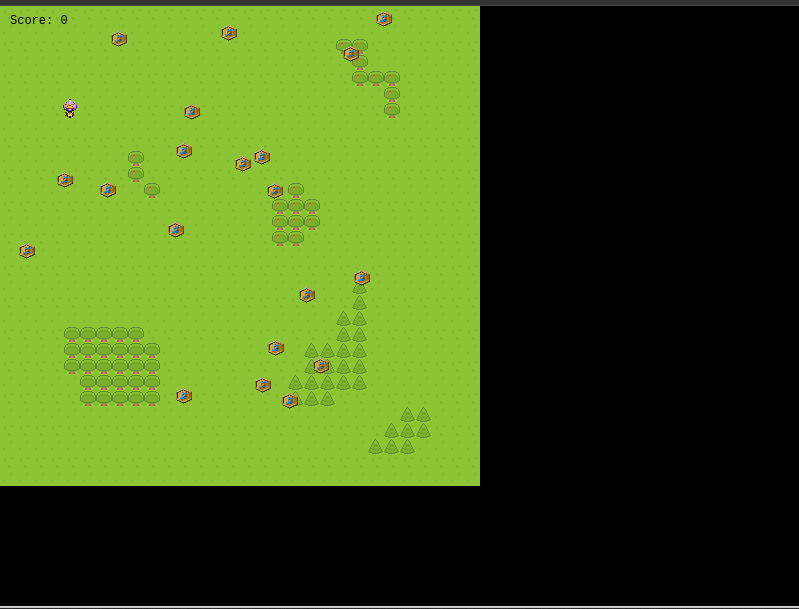

**🎮️ Name of the game: Music Medal

# Overview

## 📐 Project scope

- **Budget: None**
- **Timeline: Within 5 working days**

## 🗣️ Elevator Pitch

> It's a 2d rpg game with an alien boy who loves collecting music medals. He has to collect the golden music medals on the field. The field also contains hidden mines which explode when touched. The boy has to use his instincts to avoid the mines.

## 💵 Monetization

_This was created for educational purposes only._

# Story

_An alien boy loves to collect music medals is in a field to collect gold medals and avoid mines.

Sounds familiar?

# Gameplay

The boy can move around the field to where medals are located.

## Core Game Mechanic

- Details: Build platform game with Phaser3 Library
- How it works: Using Phaser3 JS library to create the canvas and different scenes.
- Details: Add platform and player sprite & Animate it.
- How it works: Collected assets from different resources and used Phaser3 to animate and edit different features like size, respawn, velocity, movement, color.
- Details: Add game objects
- How it works: Added glowing stars and hidden bombs and modified score upon collecting stars and death scene upon stepping on a bomb.
- Details: Add a scoreboard
- How it works: Use API to store player name and score, Then get this data and sort the top highest 5 scores and display them.

# Game elements

# 👤 Characters / 📦️ Objects

- An alien boy
- Mines
- Medals
- Trees
- Grasses

## 🏆️ missions

- 1 star = 100 score
- Avoid Mines

# Assets

## 🎨 Art

- [Art Assets: OpenGameArt](https://opengameart.org/)
- [Kenney • Assets](https://www.kenney.nl/assets)

## 🔊 Sound

- [Town Theme - Gaming Sound Effect (HD)](https://www.youtube.com/watch?v=37-paiEz0mQ)

## 🏃‍ Animation

- Walk
