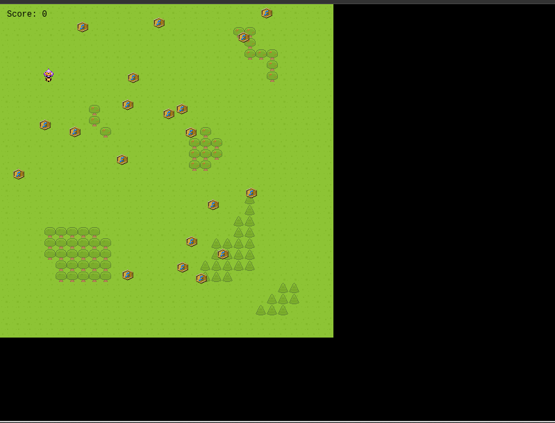

# RPG-Game

> It's a 2d rpg game with an alien boy who loves collecting music medals. He has to collect the golden music medals on the field. The field also contains hidden mines which explode when touched. The boy has to use his instincts to avoid the mines. The mines appear randomly incase you start the game and get game over message, it's because the mine appeared at the same spot as the player so it's part of the game. Just restart the game. The score board shows score of top 5 players. If your name does not appear its because you are not in the top 5 best players.




## Built With

- HTML
- CSS
- Phaser
- JavaScript
- ES6
- Webpack
- Jest

## Live Demo

**If the game take too long to load OR stuck at 91% do reload your the browser page** <br>
[Live Demo Link](https://boring-carson-13aee4.netlify.app/)


## Game Design Document

This is a game based on an alien boy who loves music with a mission to collect as many music medals as possible to come as number 1 on the leaderboard.
He must avoid mines or otherwise he meets his doom.
[Game Design Document (GDD) Link](./GDD.md)

### How to play

- WALK:
  Use the directions keys on your keyboard to navigate around to field to collect the medals.

### Prerequisites

- Live Server plugin for Visual Studio Code

### Setup

1- Clone the repository

```
    git clone git@github.com:HillaryOkello/RPG-Game.git
```

2- Open the folder on VS Code.

```
    cd RPG-Game
    code .
```

3- install Packages

```
    npm install

```

4- webpack compile
```
		npx webpack --watch
```

5- run vs code live server

### Testing

Run the next on your terminal in the repository folder:

```
    npm run test
```

## Author

👤 **Hillary Okello**

- GitHub: [@HillaryOkello](https://github.com/HillaryOkello)
- Twitter: [@Kellyhillary4](https://twitter.com/Kellyhillary4)
- LinkedIn: [LinkedIn](https://www.linkedin.com/in/hillary-okello/)

## Show your support

Give a ⭐️ if you like this project!

## Acknowledgments

- Credit (Kenney or www.kenney.nl) and (opengameart.org)
- All respective designers and developers who gave me the chance to use their assets and packages
- [Microverse](https://www.microverse.org/).
